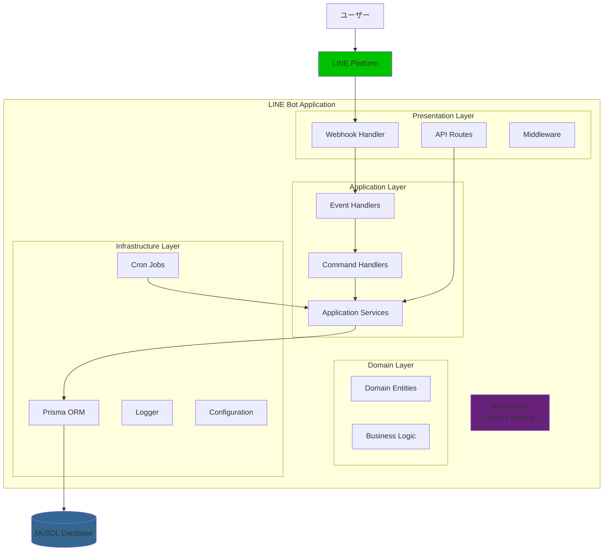

# アーキテクチャ設計書

## 概要

本システムは、家庭用食事管理LINEボットとして設計されており、TypeScript、Hono、Prisma、MySQLを使用したWebアプリケーションです。

## システム全体構成



## 層別責務

### 1. Presentation Layer（プレゼンテーション層）

**責務**: 外部とのインターフェースを管理

#### Webhook Handler (`src/features/line/webhooks.ts`)
- LINEプラットフォームからのイベント受信
- 署名検証によるセキュリティ確保
- イベントタイプの判定と適切なハンドラーへの振り分け

#### API Routes (`src/routes/`)
- REST APIエンドポイントの定義
- ヘルスチェック機能
- 通知機能のAPIエンドポイント

#### Middleware (`src/middleware/`)
- グローバルエラーハンドリング
- リクエスト/レスポンス処理
- ログ出力

### 2. Application Layer（アプリケーション層）

**責務**: ビジネスロジックの調整とイベント処理

#### Event Handlers (`src/features/line/handlers/`)
- **Follow Handler**: ユーザーフォロー時の処理
- **Message Handler**: テキストメッセージ・コマンド処理
- **Postback Handler**: インタラクティブ要素からの応答処理

#### Command Handlers (`src/features/meal/commands/`)
- **Register Command**: 食事予定登録
- **Check Command**: 食事予定確認
- **Calendar Command**: カレンダー表示
- **Help Command**: ヘルプ情報提供

#### Application Services (`src/features/meal/services/`)
- **User Service**: ユーザー管理機能
- **Meal Service**: 食事予定管理機能
- **Calendar Service**: カレンダー表示機能

### 3. Domain Layer（ドメイン層）

**責務**: 核となるビジネスルールとドメインロジック

#### Domain Entities
Prismaスキーマで定義されたエンティティ:
- **User**: システム利用者
- **MealPlan**: 食事予定
- **MealParticipation**: 食事参加状況
- **NotificationLog**: 通知履歴

#### Business Rules
- 同一日の同一食事タイプは1つのプランのみ
- 参加状況はユーザーごとに1つのみ
- 自炊の場合は調理担当者の指定が必要

### 4. Infrastructure Layer（インフラストラクチャ層）

**責務**: 技術的な実装詳細とデータ永続化

#### Data Access (`src/lib/prisma.ts`)
- Prisma ORMによるデータベース接続
- シングルトンパターンによる接続管理

#### External Services (`src/features/line/client.ts`)
- LINE Bot SDKによるメッセージ送信
- Flexメッセージ・テンプレートメッセージ生成

#### Cross-cutting Concerns
- **Logger** (`src/lib/logger.ts`): 構造化ログ出力
- **Configuration** (`src/config/`): 環境設定管理
- **Error Handling** (`src/utils/error.ts`): カスタムエラー定義

## 主要な設計パターン

### 1. レイヤードアーキテクチャ
- 関心の分離によるモジュール性の確保
- 依存関係の一方向性（上位層→下位層）
- テスタビリティの向上

### 2. Feature-based組織化
```
src/features/
├── line/          # LINE関連機能
├── meal/          # 食事管理機能
└── notification/  # 通知機能
```

### 3. Dependency Injection
- Prismaクライアントのシングルトン管理
- 設定値の外部注入
- テスト容易性の確保

### 4. Command Pattern
- コマンドハンドラーによるユーザー操作の処理
- 拡張性の確保（新しいコマンドの追加が容易）

## データフロー

### 1. イベント処理フロー
```
LINE Platform → Webhook → Event Router → Handler → Service → Repository → Database
```

### 2. 通知処理フロー
```
Cron Job → Notification Service → LINE Client → LINE Platform → User
```

### 3. API処理フロー
```
HTTP Request → Router → Middleware → Service → Repository → Database
```

## セキュリティ

### 1. 認証・認可
- LINE署名検証による正当性確認
- ユーザーIDによる認可制御
- データベースでの許可ユーザー管理

### 2. データ保護
- 環境変数による機密情報管理
- Prismaによるパラメータ化クエリ
- 適切なエラーハンドリング

## 拡張性への配慮

### 1. 新機能追加
- Feature-based構造により新機能の追加が容易
- コマンドパターンにより新しいユーザー操作の追加が簡単

### 2. 外部システム連携
- Infrastructure層での抽象化により外部システム変更への対応が可能
- 設定値の外部化により環境ごとの設定変更が容易

### 3. スケーラビリティ
- ステートレス設計によるスケーラビリティの確保
- データベース接続プールによる効率的なリソース利用

## パフォーマンス考慮事項

### 1. データベースアクセス最適化
- Prismaによる効率的なクエリ生成
- 必要なリレーションのみの取得（includeの適切な使用）

### 2. 非同期処理
- 通知処理の非同期実行
- Promise.allによる並列処理の活用

### 3. エラーハンドリング
- 段階的なエラー処理とフォールバック機能
- 適切なログ出力によるデバッグ支援

## 今後の改善点

1. **キャッシュ戦略**: 頻繁にアクセスされるデータのキャッシュ
2. **モニタリング**: メトリクス収集とアラート機能
3. **テストカバレッジ**: より包括的なテストスイート
4. **ドキュメント**: API仕様書の整備
5. **CI/CD**: 自動デプロイメントパイプラインの構築