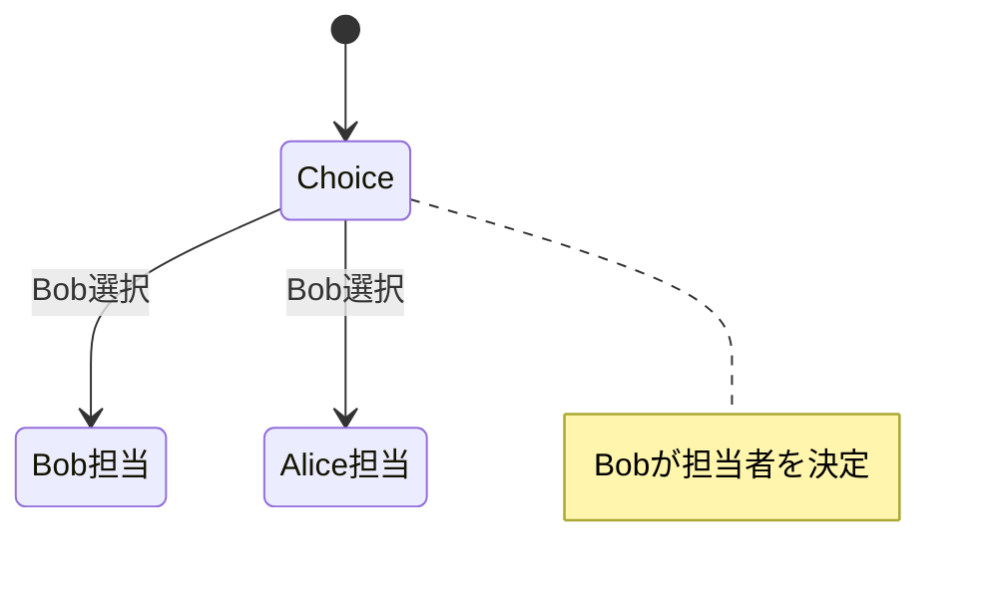
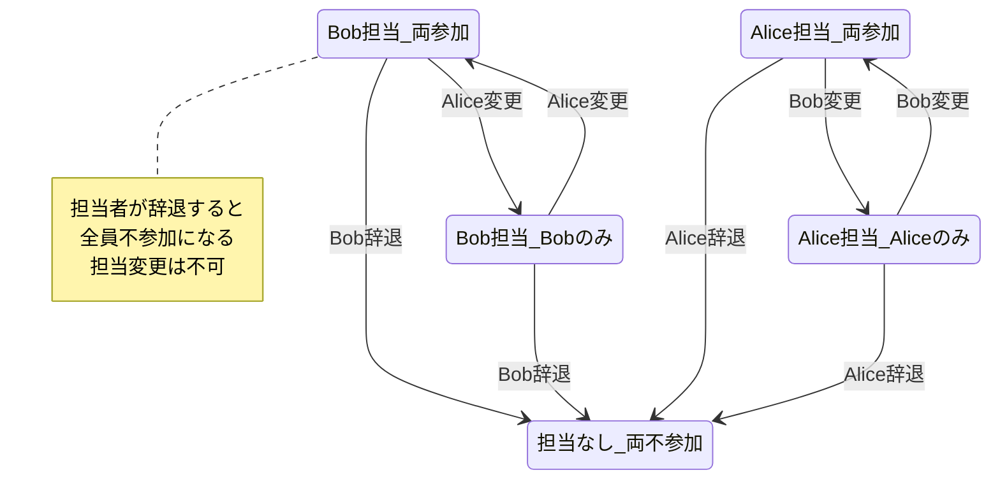
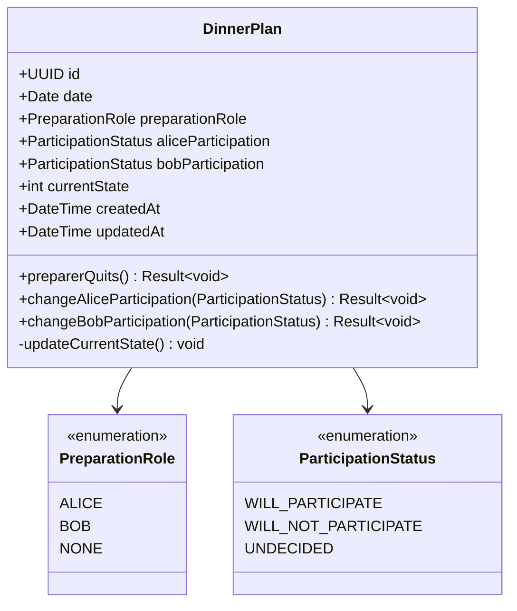

# 夕食ドメイン (Dinner Domain)

## 概要
AliceとBobの夕食における「準備担当」と「参加状況」を管理するドメイン。誰が用意するかと誰が参加するかを明確に分離して管理する。

## コア概念

### 準備担当 (Preparation Role)
夕食を用意する責任者
- **Alice担当**: Aliceが夕食を用意する
- **Bob担当**: Bobが夕食を用意する  
- **担当なし**: 誰も用意しない（各自調達、外食等）

### 参加状況 (Participation Status)
夕食への参加意向
- **参加**: 夕食を一緒に食べる
- **不参加**: 夕食に参加しない
- **未定**: 参加するかどうか決まっていない

## 状態定義

### 可能な状態
| 状態 | 準備担当 | Alice参加 | Bob参加 | 説明 |
|------|----------|-----------|---------|------|
| 1 | Bob | 参加 | 参加 | Bob用意、二人で食事 |
| 2 | Bob | 不参加 | 参加 | Bob用意、Bobのみ食事 |
| 3 | Alice | 参加 | 参加 | Alice用意、二人で食事 |
| 4 | Alice | 参加 | 不参加 | Alice用意、Aliceのみ食事 |
| 5 | なし | 不参加 | 不参加 | 誰も用意せず、各自調達 |

### 状態遷移図

#### 初期状態選択


#### 状態遷移（全体）


## エンティティ

### DinnerPlan
夕食計画を表現する集約ルート

#### 属性
- `id`: 一意識別子 (UUID)
- `date`: 対象日
- `preparationRole`: 準備担当者 ('Alice' | 'Bob' | 'None')
- `aliceParticipation`: Aliceの参加状況
- `bobParticipation`: Bobの参加状況
- `currentState`: 現在の状態番号 (1-5)
- `createdAt`: 作成日時
- `updatedAt`: 更新日時

## 値オブジェクト

### PreparationRole
```typescript
enum PreparationRole {
  ALICE = 'Alice',
  BOB = 'Bob', 
  NONE = 'None'
}
```

### ParticipationStatus
```typescript
enum ParticipationStatus {
  WILL_PARTICIPATE = '参加',
  WILL_NOT_PARTICIPATE = '不参加',
  UNDECIDED = '未定'
}
```

## ビジネスルール

### 基本原則
1. **初期状態**: Bobが担当者を決定（Alice担当 or Bob担当）
2. **担当者固定**: 一度決めた担当者は変更されない
3. **辞退の自動遷移**: 担当者が辞退すると全員が自動的に不参加になる

### ドメインロジック

#### 担当者辞退
```typescript
class DinnerPlan {
  preparerQuits(): Result<void> {
    // 担当者が辞退すると全員不参加
    this.preparationRole = PreparationRole.NONE;
    this.aliceParticipation = ParticipationStatus.WILL_NOT_PARTICIPATE;
    this.bobParticipation = ParticipationStatus.WILL_NOT_PARTICIPATE;
    
    this.updateCurrentState();
    return Result.success();
  }
}
```

#### 参加状況変更
```typescript
class DinnerPlan {
  changeAliceParticipation(status: ParticipationStatus): Result<void> {
    // 担当者は参加必須
    if (this.preparationRole === PreparationRole.ALICE && 
        status === ParticipationStatus.WILL_NOT_PARTICIPATE) {
      return Result.failure("担当者は参加必須です");
    }
    
    this.aliceParticipation = status;
    this.updateCurrentState();
    return Result.success();
  }
  
  changeBobParticipation(status: ParticipationStatus): Result<void> {
    // 担当者は参加必須
    if (this.preparationRole === PreparationRole.BOB && 
        status === ParticipationStatus.WILL_NOT_PARTICIPATE) {
      return Result.failure("担当者は参加必須です");
    }
    
    this.bobParticipation = status;
    this.updateCurrentState();
    return Result.success();
  }
}
```

## ユースケース

### 1. 夕食計画作成
**アクター**: Bob
**前提条件**: 対象日の計画が未作成

**メインフロー**:
1. 対象日を指定
2. Bobが担当者を選択（Alice or Bob）
3. 初期状態で保存

### 2. 参加状況変更
**アクター**: Alice または Bob

**メインフロー**:
1. 現在の計画を確認
2. 自分の参加状況を変更
3. ビジネスルール検証
4. 状態更新

**例外フロー**:
- 担当者が不参加を選択 → エラー

### 3. 担当者辞退
**アクター**: 現在の担当者

**メインフロー**:
1. 辞退を選択
2. 自動的に全員不参加に変更
3. 担当なし状態に遷移

## クラス図


## リポジトリ

### DinnerPlanRepository
```typescript
interface DinnerPlanRepository {
  findByDate(date: Date): Promise<DinnerPlan | null>;
  save(plan: DinnerPlan): Promise<DinnerPlan>;
  findByDateRange(from: Date, to: Date): Promise<DinnerPlan[]>;
}
```

## ドメインイベント

### DinnerPlanCreated
計画作成時に発行
```typescript
interface DinnerPlanCreated {
  planId: string;
  date: Date;
  initialPreparationRole: PreparationRole;
  createdBy: 'Bob';
  occurredAt: Date;
}
```

### PreparationRoleQuitted  
担当者辞退時に発行
```typescript
interface PreparationRoleQuitted {
  planId: string;
  date: Date;
  quittedRole: PreparationRole;
  quittedBy: 'Alice' | 'Bob';
  occurredAt: Date;
}
```

### ParticipationChanged
参加状況変更時に発行
```typescript
interface ParticipationChanged {
  planId: string;
  date: Date;
  person: 'Alice' | 'Bob';
  fromStatus: ParticipationStatus;
  toStatus: ParticipationStatus;
  occurredAt: Date;
}
```

## 不変条件

1. **状態整合性**: currentStateは常に(preparationRole, aliceParticipation, bobParticipation)の組み合わせと一致
2. **日付一意性**: 同一日に複数の夕食計画は存在しない
3. **状態制約**: 定義された5つの状態のみ存在可能
4. **担当者制約**: 担当者は必ず参加状態である
5. **排他制約**: 複数人が同時に担当になることはない

## 外部依存

- ユーザードメイン (Alice、Bobの識別)
- 通知システム (計画変更・担当変更通知)