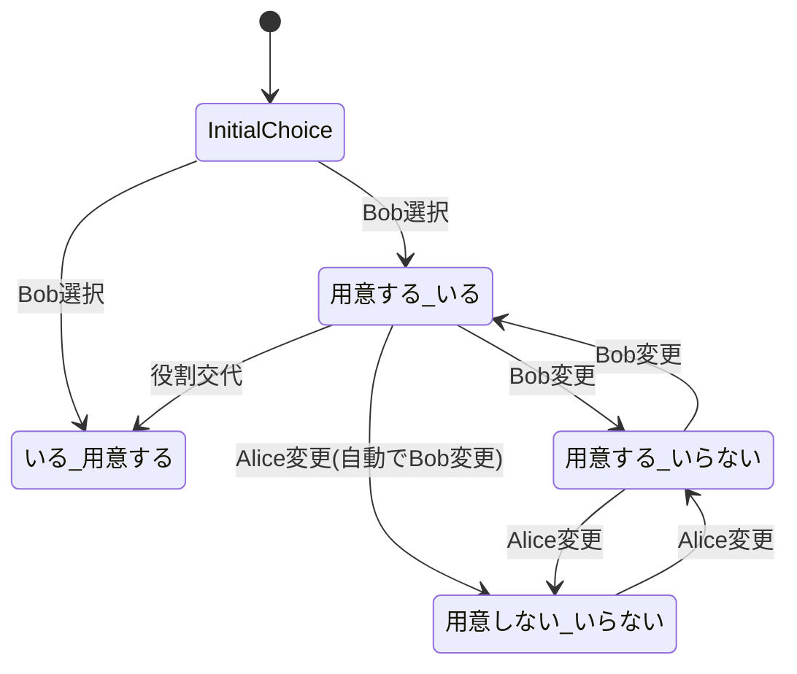
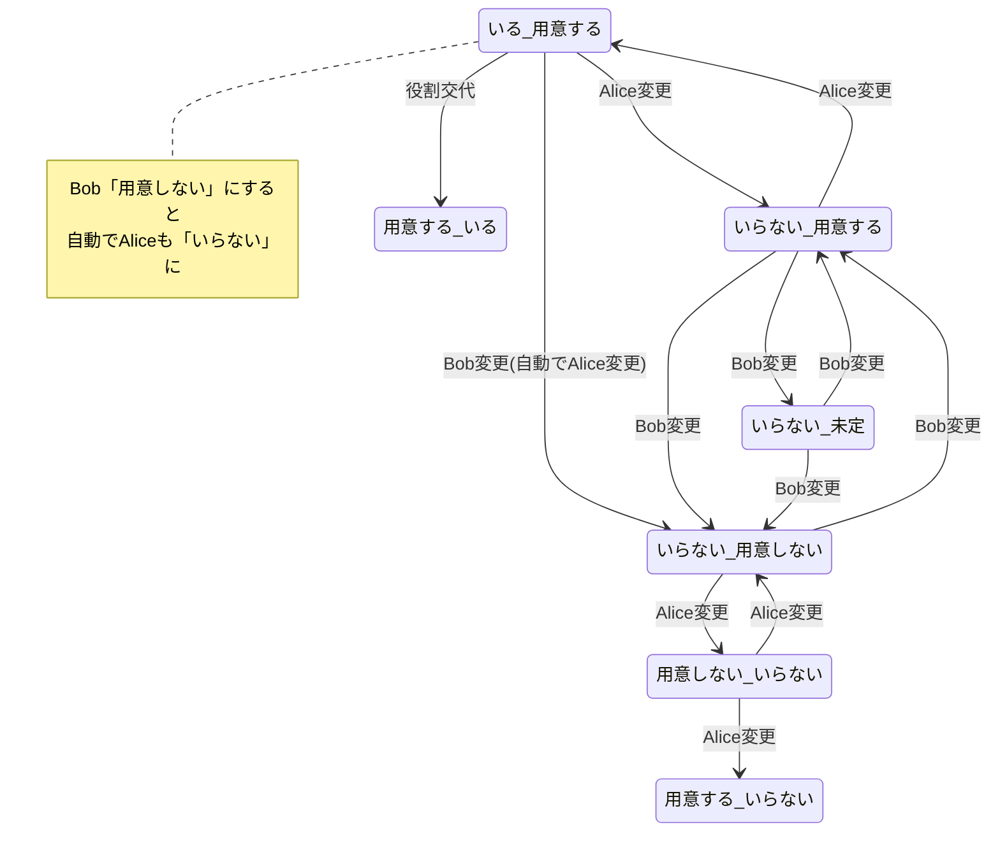
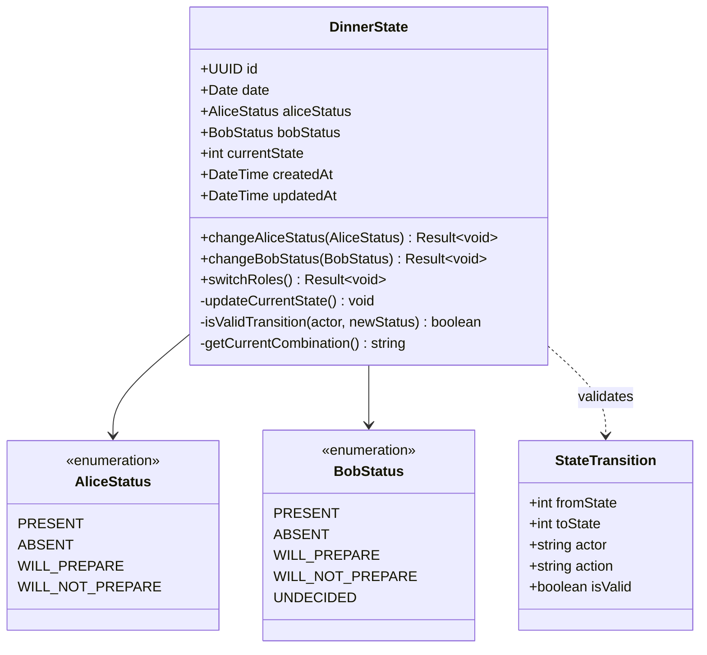

# 夕食ドメイン (Dinner Domain)

## 概要
AliceとBobの夕食計画における状態管理を行うドメイン。各ユーザーの参加状況と用意担当に基づいた複合的な状態遷移を管理する。

## 状態定義

### 可能な状態
| 状態 | Alice | Bob | 説明 |
|------|-------|-----|------|
| 1 | いる | 用意する | Aliceが参加、Bobが用意 |
| 2 | いらない | 用意する | Aliceが不参加、Bobが用意 |
| 3 | いらない | 用意しない | Aliceが不参加、Bobも用意しない |
| 4 | いらない | 未定 | Aliceが不参加、Bobは未定 |
| 5 | 用意する | いる | Aliceが用意、Bobが参加 |
| 6 | 用意する | いらない | Aliceが用意、Bobが不参加 |
| 7 | 用意しない | いらない | 両者とも用意しない・不参加 |

### 状態遷移図

#### 初期状態選択とAlice担当グループ


#### Bob担当グループ


## エンティティ

### DinnerState
夕食の状態を表現する集約ルート

#### 属性
- `id`: 一意識別子 (UUID)
- `date`: 対象日
- `aliceStatus`: Aliceの状況（いる/いらない/用意する/用意しない）
- `bobStatus`: Bobの状況（いる/いらない/用意する/用意しない/未定）
- `currentState`: 現在の状態番号 (1-7)
- `createdAt`: 作成日時
- `updatedAt`: 更新日時

## 値オブジェクト

### AliceStatus
```typescript
enum AliceStatus {
  PRESENT = 'いる',              // 参加する
  ABSENT = 'いらない',            // 参加しない
  WILL_PREPARE = '用意する',      // 用意する
  WILL_NOT_PREPARE = '用意しない'  // 用意しない
}
```

### BobStatus
```typescript
enum BobStatus {
  PRESENT = 'いる',              // 参加する
  ABSENT = 'いらない',            // 参加しない
  WILL_PREPARE = '用意する',      // 用意する
  WILL_NOT_PREPARE = '用意しない', // 用意しない
  UNDECIDED = '未定'             // 未決定
}
```

### StateTransition
```typescript
interface StateTransition {
  fromState: number;
  toState: number;
  actor: 'Alice' | 'Bob';
  action: string;
  isValid: boolean;
}
```

## ビジネスルール

### 状態遷移制約
1. **初期状態**: 新規作成時はBobが状態1または状態5を選択
2. **役割制約**: 同時に両者が「用意する」状態にはならない
3. **自動遷移制約**: 用意担当者が「用意しない」に変更すると、相手も自動的に「いらない」に変更
4. **論理制約**: 誰も用意しない場合、両者とも「いらない」または「未定」
5. **遷移制約**: 各状態からは隣接する論理的状態にのみ遷移可能
6. **排他制御**: 同時変更時は最後の更新が優先

### ドメインロジック

#### Alice状態変更
```typescript
class DinnerState {
  changeAliceStatus(newStatus: AliceStatus): Result<void> {
    const currentCombination = this.getCurrentCombination();
    
    // 状態遷移の妥当性をチェック
    if (!this.isValidTransition('Alice', newStatus)) {
      return Result.failure("無効な状態遷移です");
    }
    
    this.aliceStatus = newStatus;
    this.updateCurrentState();
    return Result.success();
  }
}
```

#### Bob状態変更
```typescript
class DinnerState {
  changeBobStatus(newStatus: BobStatus): Result<void> {
    const currentCombination = this.getCurrentCombination();
    
    // 状態遷移の妥当性をチェック
    if (!this.isValidTransition('Bob', newStatus)) {
      return Result.failure("無効な状態遷移です");
    }
    
    this.bobStatus = newStatus;
    this.updateCurrentState();
    return Result.success();
  }
}
```

## ユースケース

### 1. 夕食状態作成
**アクター**: Bob
**前提条件**: 対象日の状態が未作成

**メインフロー**:
1. 対象日を指定
2. Bobが初期状態を選択（状態1または状態5）
3. 状態を保存

### 2. Alice状態変更
**アクター**: Alice
**前提条件**: 対象日の状態が存在

**メインフロー**:
1. 現在の状態を取得
2. 新しい状況を選択（いる/いらない/用意する/用意しない）
3. ビジネスルールに基づく検証
4. 状態を更新
5. 変更通知

### 3. Bob状態変更
**アクター**: Bob
**前提条件**: 対象日の状態が存在

**メインフロー**:
1. 現在の状態を取得
2. 新しい状況を選択（いる/いらない/用意する/用意しない/未定）
3. ビジネスルールに基づく検証
4. 状態を更新
5. 変更通知

### 4. 役割交代
**アクター**: AliceまたはBob
**前提条件**: 
- 一方が用意担当の状態
- 役割を交代したい意向

**メインフロー**:
1. 現在の役割分担を確認
2. 役割交代を提案
3. 相手の承認を取得
4. 状態を更新（例：状態1↔状態5）
5. 両者に通知

## クラス図


## リポジトリ

### DinnerStateRepository
```typescript
interface DinnerStateRepository {
  findByDate(date: Date): Promise<DinnerState | null>;
  save(dinnerState: DinnerState): Promise<DinnerState>;
  findByDateRange(from: Date, to: Date): Promise<DinnerState[]>;
}
```

## ドメインイベント

### DinnerStateChanged
状態変更時に発行
```typescript
interface DinnerStateChanged {
  dinnerStateId: string;
  date: Date;
  fromState: number;
  toState: number;
  changedBy: 'Alice' | 'Bob';
  aliceStatus: AliceStatus;
  bobStatus: BobStatus;
  occurredAt: Date;
}
```

### DinnerRolesSwitched
役割交代時に発行
```typescript
interface DinnerRolesSwitched {
  dinnerStateId: string;
  date: Date;
  fromState: number;
  toState: number;
  initiatedBy: 'Alice' | 'Bob';
  occurredAt: Date;
}
```

## 不変条件

1. **状態整合性**: currentStateは常に(aliceStatus, bobStatus)の組み合わせと一致
2. **日付一意性**: 同一日に複数の夕食状態は存在しない
3. **状態制約**: 定義された7つの状態のみ存在可能
4. **遷移制約**: 許可された状態遷移のみ実行可能
5. **役割制約**: 両者が同時に「用意する」状態にはならない
6. **論理制約**: 誰も用意しない場合は適切な参加状況との組み合わせのみ

## 外部依存

- ユーザードメイン (Alice、Bobの識別)
- 通知システム (状態変更・役割交代通知)