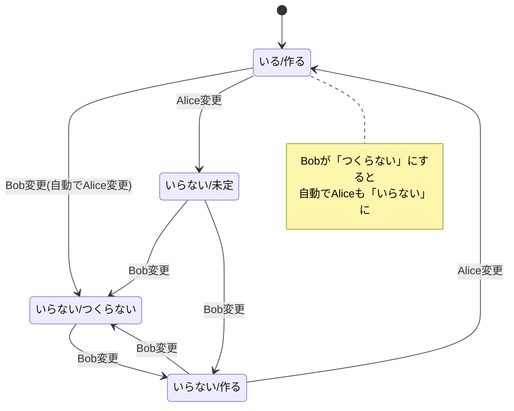
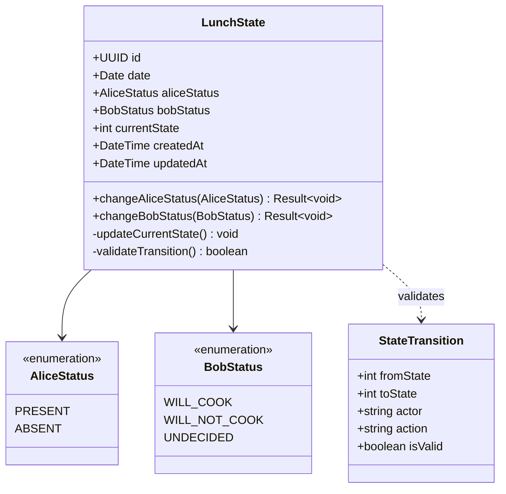

# 昼食ドメイン (Lunch Domain)

## 概要
AliceとBobの昼食計画における状態管理を行うドメイン。各ユーザーの参加状況と調理意向に基づいた状態遷移を管理する。

## 状態定義

### 可能な状態
| 状態 | Alice | Bob |
|------|-------|-----|
| 1 | いる | 作る |
| 2 | いらない | 作る |
| 3 | いらない | つくらない |
| 4 | いらない | 未定 |

### 状態遷移図


## エンティティ

### LunchState
昼食の状態を表現する集約ルート

#### 属性
- `id`: 一意識別子 (UUID)
- `date`: 対象日
- `aliceStatus`: Aliceの参加状況
- `bobStatus`: Bobの調理意向
- `currentState`: 現在の状態番号 (1,2,3,4)
- `createdAt`: 作成日時
- `updatedAt`: 更新日時

## 値オブジェクト

### AliceStatus
```typescript
enum AliceStatus {
  PRESENT = 'いる',      // 参加する
  ABSENT = 'いらない'     // 参加しない
}
```

### BobStatus
```typescript
enum BobStatus {
  WILL_COOK = '作る',           // 調理する
  WILL_NOT_COOK = 'つくらない',  // 調理しない
  UNDECIDED = '未定'            // 未決定
}
```

### StateTransition
```typescript
interface StateTransition {
  fromState: number;
  toState: number;
  actor: 'Alice' | 'Bob';
  action: string;
  isValid: boolean;
}
```

## ビジネスルール

### 状態遷移制約
1. **初期状態**: 新規作成時は状態1（いる/作る）
2. **Bob変更時の自動遷移**: Bobが「つくらない」に変更すると、Aliceも自動的に「いらない」に変更
3. **Alice制約**: Bobが「つくらない」の状態では、Aliceは「いる」に変更不可
4. **Bob制約**: 「未定」から「作る」「つくらない」への変更のみ可能
5. **排他制御**: 同時変更時は最後の更新が優先

### ドメインロジック

#### Alice状態変更
```typescript
class LunchState {
  changeAliceStatus(newStatus: AliceStatus): Result<void> {
    // Bobが「つくらない」の時、Aliceは「いる」に変更不可
    if (newStatus === AliceStatus.PRESENT && 
        this.bobStatus === BobStatus.WILL_NOT_COOK) {
      return Result.failure("Bobが調理しない場合、Aliceは参加できません");
    }
    
    this.aliceStatus = newStatus;
    this.updateCurrentState();
    return Result.success();
  }
}
```

#### Bob状態変更
```typescript
class LunchState {
  changeBobStatus(newStatus: BobStatus): Result<void> {
    // Bobが「つくらない」に変更する場合、Aliceも自動的に「いらない」に変更
    if (newStatus === BobStatus.WILL_NOT_COOK && 
        this.aliceStatus === AliceStatus.PRESENT) {
      this.aliceStatus = AliceStatus.ABSENT;
    }
    
    this.bobStatus = newStatus;
    this.updateCurrentState();
    return Result.success();
  }
}
```

## ユースケース

### 1. 昼食状態作成
**アクター**: システム
**前提条件**: 対象日の状態が未作成

**メインフロー**:
1. 対象日を指定
2. 初期状態1（いる/作る）で作成
3. 状態を保存

### 2. Alice状態変更
**アクター**: Alice
**前提条件**: 対象日の状態が存在

**メインフロー**:
1. 現在の状態を取得
2. 新しい参加状況を選択
3. ビジネスルールに基づく検証
4. 状態を更新
5. 変更通知

**例外フロー**:
- Bobが「つくらない」時に「いる」を選択 → エラー

### 3. Bob状態変更
**アクター**: Bob
**前提条件**: 対象日の状態が存在

**メインフロー**:
1. 現在の状態を取得
2. 新しい調理意向を選択
3. 「つくらない」選択時、Aliceも自動的に「いらない」に変更
4. 状態を更新
5. 変更通知

## クラス図


## リポジトリ

### LunchStateRepository
```typescript
interface LunchStateRepository {
  findByDate(date: Date): Promise<LunchState | null>;
  save(lunchState: LunchState): Promise<LunchState>;
  findByDateRange(from: Date, to: Date): Promise<LunchState[]>;
}
```

## ドメインイベント

### LunchStateChanged
状態変更時に発行
```typescript
interface LunchStateChanged {
  lunchStateId: string;
  date: Date;
  fromState: number;
  toState: number;
  changedBy: 'Alice' | 'Bob';
  aliceStatus: AliceStatus;
  bobStatus: BobStatus;
  occurredAt: Date;
}
```

## 不変条件

1. **状態整合性**: currentStateは常に(aliceStatus, bobStatus)の組み合わせと一致
2. **日付一意性**: 同一日に複数の昼食状態は存在しない
3. **状態制約**: 定義された4つの状態（1,2,3,4）のみ存在可能
4. **遷移制約**: 許可された状態遷移のみ実行可能
5. **自動遷移**: Bobが「つくらない」に変更時、Aliceは必ず「いらない」に自動変更

## 外部依存

- ユーザードメイン (Alice、Bobの識別)
- 通知システム (状態変更通知)