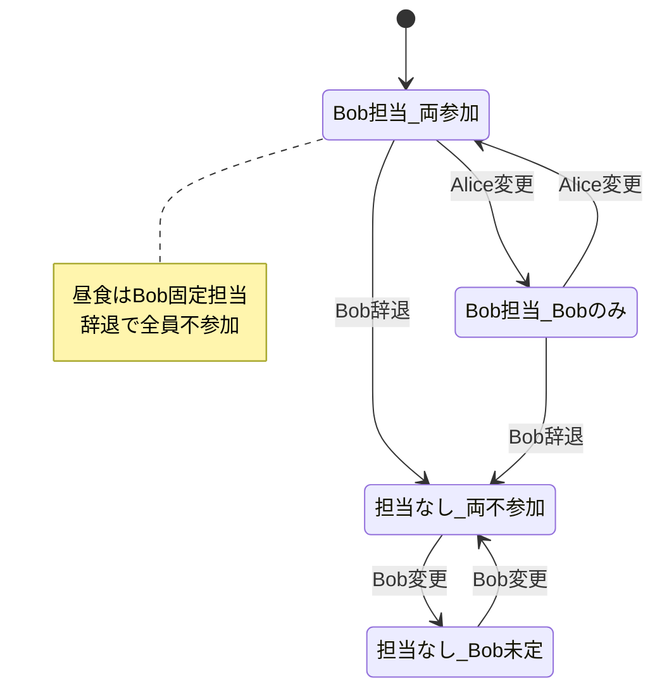
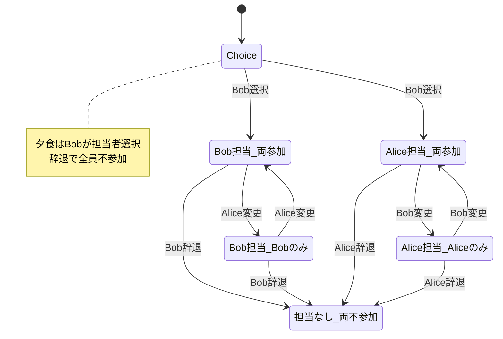
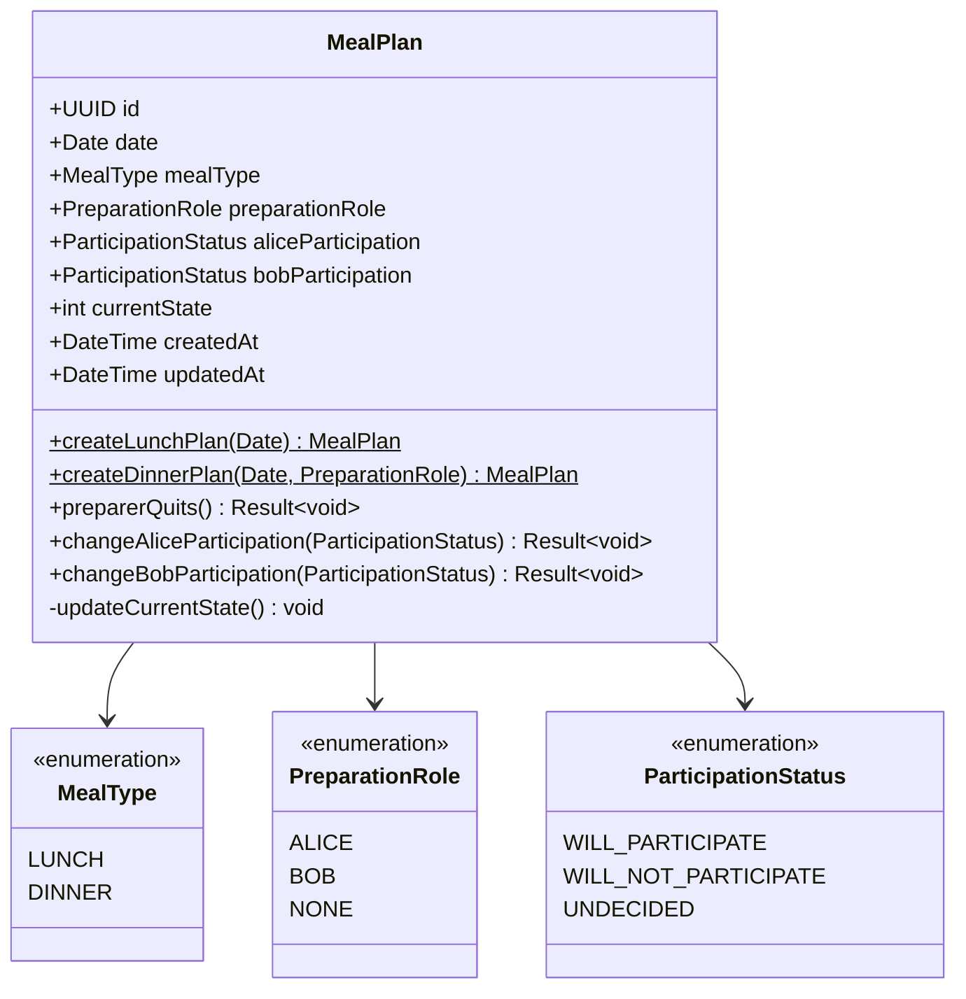

# 食事ドメイン (Meal Domain)

## 概要
AliceとBobの食事計画（昼食・夕食）を統一的に管理するドメイン。「準備担当」と「参加状況」を分離し、食事タイプ別の制約を適用する。

## コア概念

### 食事タイプ (Meal Type)
- **LUNCH**: 昼食（Bob固定担当）
- **DINNER**: 夕食（Alice/Bob選択可能）

### 準備担当 (Preparation Role)
食事を用意する責任者
- **Alice**: Aliceが食事を用意する（夕食のみ）
- **Bob**: Bobが食事を用意する（昼食・夕食）
- **None**: 誰も用意しない（各自調達、外食等）

### 参加状況 (Participation Status)
食事への参加意向
- **参加**: 食事を一緒に食べる
- **不参加**: 食事に参加しない
- **未定**: 参加するかどうか決まっていない（Bobのみ）

## 状態定義

### 昼食の状態
| 状態 | 準備担当 | Alice参加 | Bob参加 | 説明 |
|------|----------|-----------|---------|------|
| 1 | Bob | 参加 | 参加 | Bob用意、二人で食事 |
| 2 | Bob | 不参加 | 参加 | Bob用意、Bobのみ食事 |
| 3 | なし | 不参加 | 不参加 | 誰も用意せず、各自調達 |
| 4 | なし | 不参加 | 未定 | 誰も用意せず、Bobは未定 |

### 夕食の状態
| 状態 | 準備担当 | Alice参加 | Bob参加 | 説明 |
|------|----------|-----------|---------|------|
| 1 | Bob | 参加 | 参加 | Bob用意、二人で食事 |
| 2 | Bob | 不参加 | 参加 | Bob用意、Bobのみ食事 |
| 3 | Alice | 参加 | 参加 | Alice用意、二人で食事 |
| 4 | Alice | 参加 | 不参加 | Alice用意、Aliceのみ食事 |
| 5 | なし | 不参加 | 不参加 | 誰も用意せず、各自調達 |

### 状態遷移図

#### 昼食の状態遷移


#### 夕食の状態遷移


## エンティティ

### MealPlan
食事計画を表現する集約ルート

#### 属性
- `id`: 一意識別子 (UUID)
- `date`: 対象日
- `mealType`: 食事タイプ (LUNCH | DINNER)
- `preparationRole`: 準備担当者 ('Alice' | 'Bob' | 'None')
- `aliceParticipation`: Aliceの参加状況
- `bobParticipation`: Bobの参加状況
- `currentState`: 現在の状態番号
- `createdAt`: 作成日時
- `updatedAt`: 更新日時

## 値オブジェクト

### MealType
```typescript
enum MealType {
  LUNCH = 'LUNCH',
  DINNER = 'DINNER'
}
```

### PreparationRole
```typescript
enum PreparationRole {
  ALICE = 'Alice',
  BOB = 'Bob',
  NONE = 'None'
}
```

### ParticipationStatus
```typescript
enum ParticipationStatus {
  WILL_PARTICIPATE = '参加',
  WILL_NOT_PARTICIPATE = '不参加',
  UNDECIDED = '未定'
}
```

## ビジネスルール

### 基本原則
1. **昼食制約**: 昼食の準備担当はBob固定
2. **夕食制約**: 夕食の準備担当はBobが選択（Alice or Bob）
3. **担当者固定**: 一度決めた担当者は変更されない
4. **辞退の自動遷移**: 担当者が辞退すると全員が自動的に不参加になる
5. **担当者参加必須**: 担当者は必ず参加状態である

### ドメインロジック

#### 食事計画作成
```typescript
class MealPlan {
  static createLunchPlan(date: Date): MealPlan {
    return new MealPlan({
      date,
      mealType: MealType.LUNCH,
      preparationRole: PreparationRole.BOB, // Bob固定
      aliceParticipation: ParticipationStatus.WILL_PARTICIPATE,
      bobParticipation: ParticipationStatus.WILL_PARTICIPATE
    });
  }
  
  static createDinnerPlan(date: Date, preparationRole: PreparationRole): MealPlan {
    if (preparationRole === PreparationRole.NONE) {
      throw new Error("夕食では担当者の指定が必要です");
    }
    
    const aliceParticipation = preparationRole === PreparationRole.ALICE 
      ? ParticipationStatus.WILL_PARTICIPATE 
      : ParticipationStatus.WILL_PARTICIPATE;
    const bobParticipation = preparationRole === PreparationRole.BOB 
      ? ParticipationStatus.WILL_PARTICIPATE 
      : ParticipationStatus.WILL_PARTICIPATE;
    
    return new MealPlan({
      date,
      mealType: MealType.DINNER,
      preparationRole,
      aliceParticipation,
      bobParticipation
    });
  }
}
```

#### 担当者辞退
```typescript
class MealPlan {
  preparerQuits(): Result<void> {
    if (this.preparationRole === PreparationRole.NONE) {
      return Result.failure("担当者が設定されていません");
    }
    
    // 担当者が辞退すると全員不参加
    this.preparationRole = PreparationRole.NONE;
    this.aliceParticipation = ParticipationStatus.WILL_NOT_PARTICIPATE;
    this.bobParticipation = ParticipationStatus.WILL_NOT_PARTICIPATE;
    
    this.updateCurrentState();
    return Result.success();
  }
}
```

#### 参加状況変更
```typescript
class MealPlan {
  changeAliceParticipation(status: ParticipationStatus): Result<void> {
    // 担当者は参加必須
    if (this.preparationRole === PreparationRole.ALICE && 
        status === ParticipationStatus.WILL_NOT_PARTICIPATE) {
      return Result.failure("担当者は参加必須です");
    }
    
    // 昼食でAliceが不参加の場合、Bobが辞退すると自動で不参加
    if (this.mealType === MealType.LUNCH && 
        status === ParticipationStatus.WILL_NOT_PARTICIPATE &&
        this.bobParticipation === ParticipationStatus.WILL_NOT_PARTICIPATE) {
      this.preparerQuits();
      return Result.success();
    }
    
    this.aliceParticipation = status;
    this.updateCurrentState();
    return Result.success();
  }
  
  changeBobParticipation(status: ParticipationStatus): Result<void> {
    // 担当者は参加必須
    if (this.preparationRole === PreparationRole.BOB && 
        status === ParticipationStatus.WILL_NOT_PARTICIPATE) {
      return Result.failure("担当者は参加必須です");
    }
    
    // 昼食でBobが用意しない場合、Aliceも自動で不参加
    if (this.mealType === MealType.LUNCH && 
        status === ParticipationStatus.WILL_NOT_PARTICIPATE) {
      this.preparerQuits();
      return Result.success();
    }
    
    this.bobParticipation = status;
    this.updateCurrentState();
    return Result.success();
  }
}
```

## ユースケース

### 1. 昼食計画作成
**アクター**: システム（自動）
**前提条件**: 対象日の昼食計画が未作成

**メインフロー**:
1. 対象日を指定
2. Bob担当で自動作成
3. 初期状態（両者参加）で保存

### 2. 夕食計画作成
**アクター**: Bob
**前提条件**: 対象日の夕食計画が未作成

**メインフロー**:
1. 対象日を指定
2. Bobが担当者を選択（Alice or Bob）
3. 初期状態で保存

### 3. 参加状況変更
**アクター**: Alice または Bob

**メインフロー**:
1. 現在の計画を確認
2. 自分の参加状況を変更
3. ビジネスルール検証
4. 状態更新

**例外フロー**:
- 担当者が不参加を選択 → エラー
- 昼食でBobが辞退 → 自動で全員不参加

### 4. 担当者辞退
**アクター**: 現在の担当者

**メインフロー**:
1. 辞退を選択
2. 自動的に全員不参加に変更
3. 担当なし状態に遷移

## クラス図


## リポジトリ

### MealPlanRepository
```typescript
interface MealPlanRepository {
  findByDateAndType(date: Date, mealType: MealType): Promise<MealPlan | null>;
  save(plan: MealPlan): Promise<MealPlan>;
  findByDateRange(from: Date, to: Date): Promise<MealPlan[]>;
  findByDateRangeAndType(from: Date, to: Date, mealType: MealType): Promise<MealPlan[]>;
}
```

## ドメインイベント

### MealPlanCreated
食事計画作成時に発行
```typescript
interface MealPlanCreated {
  planId: string;
  date: Date;
  mealType: MealType;
  initialPreparationRole: PreparationRole;
  createdBy: 'System' | 'Bob';
  occurredAt: Date;
}
```

### PreparationRoleQuitted
担当者辞退時に発行
```typescript
interface PreparationRoleQuitted {
  planId: string;
  date: Date;
  mealType: MealType;
  quittedRole: PreparationRole;
  quittedBy: 'Alice' | 'Bob';
  occurredAt: Date;
}
```

### ParticipationChanged
参加状況変更時に発行
```typescript
interface ParticipationChanged {
  planId: string;
  date: Date;
  mealType: MealType;
  person: 'Alice' | 'Bob';
  fromStatus: ParticipationStatus;
  toStatus: ParticipationStatus;
  occurredAt: Date;
}
```

## 不変条件

1. **状態整合性**: currentStateは常に(mealType, preparationRole, aliceParticipation, bobParticipation)の組み合わせと一致
2. **日付一意性**: 同一日・同一食事タイプに複数の計画は存在しない
3. **昼食制約**: 昼食の準備担当はBobまたはNoneのみ
4. **夕食制約**: 夕食の準備担当はAlice、Bob、Noneのいずれか
5. **担当者制約**: 担当者は必ず参加状態である
6. **排他制約**: 複数人が同時に担当になることはない

## 食事タイプ別制約

### 昼食 (LUNCH)
- 準備担当: Bob固定（変更不可）
- 初期化: 自動でBob担当・両者参加
- 特殊ルール: Bobが辞退するとAliceも自動で不参加

### 夕食 (DINNER)  
- 準備担当: Alice/Bob選択可能
- 初期化: Bobが担当者を選択
- 特殊ルール: 担当者が辞退すると全員不参加

## 外部依存

- ユーザードメイン (Alice、Bobの識別)
- 通知システム (計画変更・担当変更通知)