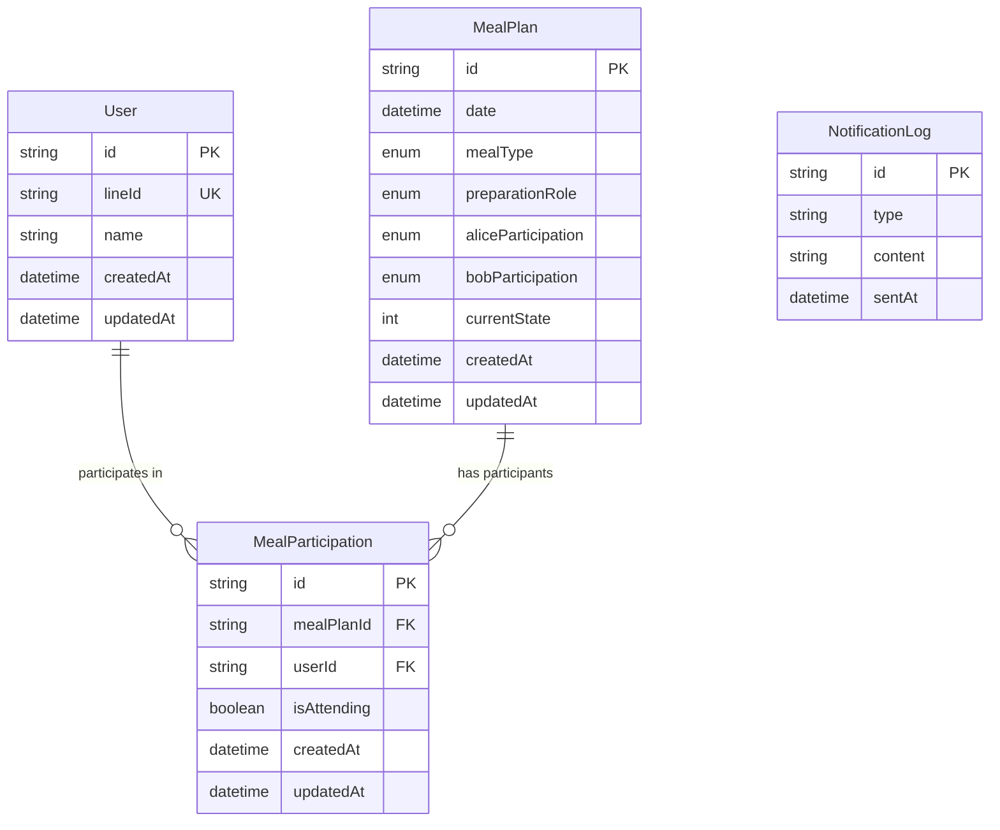

# ER図

## 概要
家庭用食事管理LINEボットのデータベースモデルを表すER図です。AliceとBobの食事計画（昼食・夕食）を統一的に管理するためのデータ構造を示しています。

**データベース**: 開発環境（SQLite）/ 本番環境（MySQL）  
**ORM**: Prisma（型安全なデータベースアクセス）

## ER図

## エンティティの説明

### User（ユーザー）
家族メンバー（AliceとBob）を表すエンティティです。
- **id**: プライマリキー、UUID形式
- **lineId**: LINE上のユーザーID（一意）
- **name**: ユーザーの名前（"Alice"または"Bob"）
- **createdAt**: レコード作成日時
- **updatedAt**: レコード更新日時

### MealPlan（食事計画）
特定の日付と食事タイプの食事計画を表すエンティティです。
- **id**: プライマリキー、UUID形式
- **date**: 食事の日付
- **mealType**: 食事タイプ（LUNCH/DINNER）
- **preparationRole**: 準備担当者（Alice/Bob/None）
- **aliceParticipation**: Aliceの参加状況（参加/不参加）
- **bobParticipation**: Bobの参加状況（参加/不参加/未定）
- **currentState**: 現在の状態番号
- **createdAt**: レコード作成日時
- **updatedAt**: レコード更新日時

### MealParticipation（食事参加）
ユーザーと食事計画の関係を表す中間テーブルです。
- **id**: プライマリキー、UUID形式
- **mealPlanId**: 食事計画ID（外部キー）
- **userId**: ユーザーID（外部キー）
- **isAttending**: 参加するかどうかのフラグ
- **createdAt**: レコード作成日時
- **updatedAt**: レコード更新日時

### NotificationLog（通知ログ）
送信された通知の履歴を記録するエンティティです。
- **id**: プライマリキー、UUID形式
- **type**: 通知タイプ（朝の通知/夜の通知/変更通知など）
- **content**: 通知の内容
- **sentAt**: 送信日時

## 関係性

1. **User - MealParticipation**: 一人のユーザーは複数の食事参加情報を持つことができます（1対多）
2. **MealPlan - MealParticipation**: 一つの食事計画は複数の食事参加情報を持つことができます（1対多）

## 制約

1. **User制約**: 
   - lineId は一意（ユニーク制約）
   - name は"Alice"または"Bob"のみ
   - システムに登録できるユーザーは2人まで

2. **MealPlan制約**:
   - date と mealType の組み合わせは一意（同じ日の同じ食事タイプは1つだけ）
   - 昼食（LUNCH）の場合、preparationRole は Bob または None のみ
   - 夕食（DINNER）の場合、preparationRole は Alice、Bob、None のいずれか

3. **MealParticipation制約**:
   - mealPlanId と userId の組み合わせは一意（同じ食事に対して同じユーザーの参加情報は1つだけ）

4. **ビジネス制約**:
   - 準備担当者（preparationRole が Alice または Bob）は必ず参加状態である
   - 準備担当者が辞退すると、全員が自動的に不参加になる 