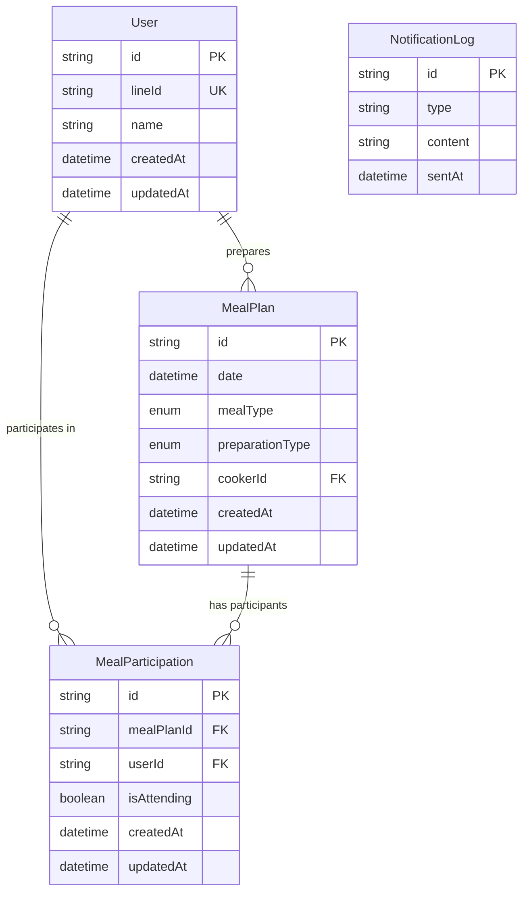

# ER図

## 概要
家庭用食事管理LINEボットのデータベースモデルを表すER図です。このER図は、アプリケーションで使用される主要なエンティティとその関係を示しています。

**データベース**: 開発環境（SQLite）/ 本番環境（MySQL）  
**ORM**: Prisma（型安全なデータベースアクセス）

## ER図

## エンティティの説明

### User（ユーザー）
家族メンバーを表すエンティティです。
- **id**: プライマリキー、UUID形式
- **lineId**: LINE上のユーザーID（一意）
- **name**: ユーザーの名前
- **createdAt**: レコード作成日時
- **updatedAt**: レコード更新日時

### MealPlan（食事予定）
特定の日付と時間帯の食事予定を表すエンティティです。
- **id**: プライマリキー、UUID形式
- **date**: 食事の日付
- **mealType**: 食事タイプ（昼食/夕食）
- **preparationType**: 準備方法（自炊/各自自由/買って一緒に）
- **cookerId**: 調理担当者のID（外部キー、自炊の場合のみ）
- **createdAt**: レコード作成日時
- **updatedAt**: レコード更新日時

### MealParticipation（食事参加）
ユーザーと食事予定の関係を表す中間テーブルです。
- **id**: プライマリキー、UUID形式
- **mealPlanId**: 食事予定ID（外部キー）
- **userId**: ユーザーID（外部キー）
- **isAttending**: 参加するかどうかのフラグ
- **createdAt**: レコード作成日時
- **updatedAt**: レコード更新日時

### NotificationLog（通知ログ）
送信された通知の履歴を記録するエンティティです。
- **id**: プライマリキー、UUID形式
- **type**: 通知タイプ（朝の通知/夜の通知/変更通知など）
- **content**: 通知の内容
- **sentAt**: 送信日時

## 関係性

1. **User - MealParticipation**: 一人のユーザーは複数の食事参加情報を持つことができます（1対多）
2. **MealPlan - MealParticipation**: 一つの食事予定は複数の食事参加情報を持つことができます（1対多）
3. **User - MealPlan**: 一人のユーザーは複数の食事予定の調理担当者になることができます（1対多）

## 制約

1. User.lineId は一意（ユニーク制約）
2. MealPlan の date と mealType の組み合わせは一意（同じ日の同じ食事タイプは1つだけ）
3. MealParticipation の mealPlanId と userId の組み合わせは一意（同じ食事に対して同じユーザーの参加情報は1つだけ） 