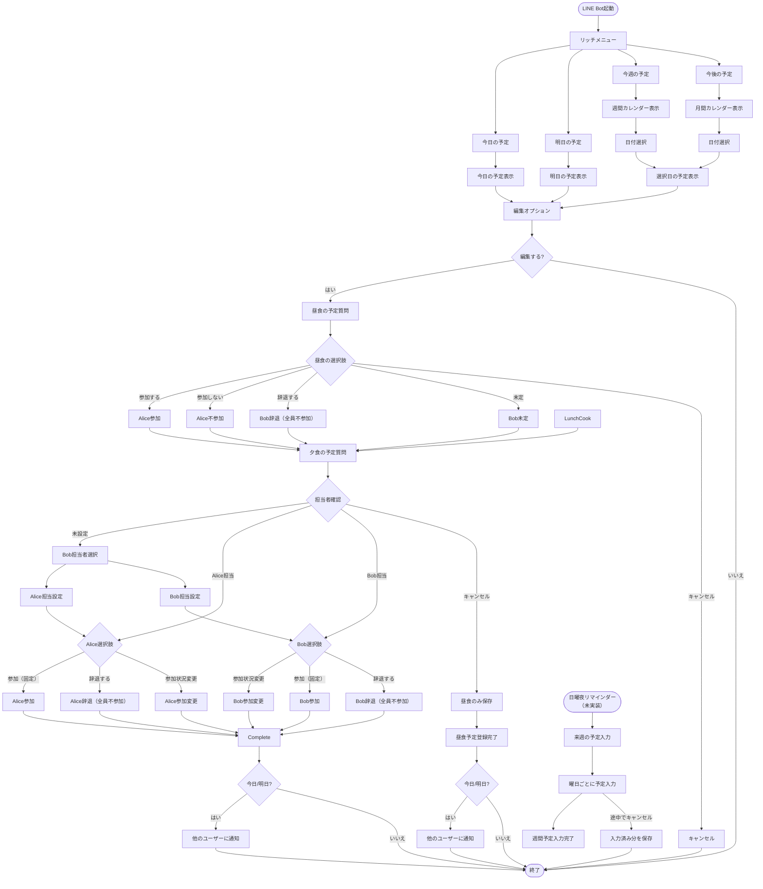

# LINEボット ユーザーフロー

## 概要

AliceとBobの食事管理LINEボットの操作フローを図解したものです。統一された食事ドメインでの昼食・夕食計画の確認・編集フローを示しています。

### 重要な制約
- 昼食: Bob固定担当、担当者変更不可
- 夕食: 初回のみBobが担当者選択（Alice or Bob）、決定後変更不可
- 担当者は必ず参加状態
- 担当者辞退時は全員自動不参加

## ユーザー操作フロー

## フロー概要

1. **リッチメニュー**
   - 「今日の予定」「明日の予定」「今週の予定」「今後の予定」の4つの主要エントリーポイント
   - 各ボタンから直接対応する時間軸の予定表示へ

2. **予定表示フロー**
   - 今日/明日：直接その日の予定を表示
   - 今週：週間カレンダー（7日間カレンダー）を表示し、日付を選択可能
   - 今後：月間カレンダーを表示し、日付を選択可能

3. **編集フロー**
   - 予定表示後に編集オプションを表示
   - 昼食→夕食の順に質問（統一ドメインモデル）
   - 昼食: Bob固定担当での参加状況変更または辞退
   - 夕食: 初回は担当者選択、設定後は参加状況変更または辞退
   - 各ステップでキャンセル可能
   - 夕食でキャンセルした場合は昼食のみ保存

4. **通知システム**
   - 今日/明日の予定変更時は他のユーザーに通知
   - 担当者辞退時の自動状態変更も通知対象
   - 日曜夜に来週の予定入力リマインダー（未実装）

5. **状態遷移の自動処理**
   - 担当者辞退時の全員不参加遷移
   - ビジネスルール違反時のエラー表示
   - 状態整合性の自動維持

6. **週間予定入力（未実装）**
   - 日曜夜のリマインダーから来週の予定を曜日ごとに入力
   - 途中でキャンセルした場合は入力済みの分だけ保存 