# LINEボット ユーザーフロー

## 概要

家庭用食事管理LINEボットの操作フローを図解したものです。ユーザーがリッチメニューから食事予定の確認・編集を行う一連の流れを示しています。

## ユーザー操作フロー

```mermaid
flowchart TD
    Start([LINE Bot起動]) --> RichMenu[リッチメニュー]
    
    %% リッチメニューの主要項目
    RichMenu --> Today[今日の予定]
    RichMenu --> Tomorrow[明日の予定]
    RichMenu --> ThisWeek[今週の予定]
    RichMenu --> Future[今後の予定]
    
    %% 直接アクセスフロー（予定表示）
    Today --> ShowToday[今日の予定表示]
    Tomorrow --> ShowTomorrow[明日の予定表示]
    ThisWeek --> ShowWeek[週間カレンダー表示]
    Future --> DateSelectView[日付選択]
    
    ShowWeek --> SelectDateFromWeek[日付選択]
    DateSelectView --> ShowDate[選択日の予定表示]
    SelectDateFromWeek --> ShowDate
    
    %% 予定表示後の編集オプション
    ShowToday --> EditOption[編集オプション]
    ShowTomorrow --> EditOption
    ShowDate --> EditOption
    
    EditOption --> EditChoice{編集する?}
    EditChoice -->|はい| LunchQ[昼食の予定質問]
    EditChoice -->|いいえ| End([終了])
    
    %% 編集フロー（時間軸選択なし）
    LunchQ --> LunchChoice{選択肢}
    LunchChoice -->|参加する| LunchAttend[参加]
    LunchChoice -->|参加しない| LunchAbsent[不参加]
    LunchChoice -->|自分が作る| LunchCook[自炊]
    LunchChoice -->|未定| LunchUndecided[未定]
    LunchChoice -->|キャンセル| Cancel1[キャンセル]
    
    Cancel1 --> End
    
    LunchAttend --> DinnerQ[夕食の予定質問]
    LunchAbsent --> DinnerQ
    LunchCook --> DinnerQ
    LunchUndecided --> DinnerQ
    
    DinnerQ --> DinnerChoice{選択肢}
    DinnerChoice -->|参加する| DinnerAttend[参加]
    DinnerChoice -->|参加しない| DinnerAbsent[不参加]
    DinnerChoice -->|自分が作る| DinnerCook[自炊]
    DinnerChoice -->|未定| DinnerUndecided[未定]
    DinnerChoice -->|キャンセル| SaveLunchOnly[昼食のみ保存]
    
    DinnerAttend --> Complete[登録完了]
    DinnerAbsent --> Complete
    DinnerCook --> Complete
    DinnerUndecided --> Complete
    
    SaveLunchOnly --> Notify2[昼食予定登録完了]
    Notify2 --> CheckToday2{今日/明日?}
    CheckToday2 -->|はい| NotifyOthers2[他のユーザーに通知]
    CheckToday2 -->|いいえ| End
    NotifyOthers2 --> End
    
    Complete --> CheckToday{今日/明日?}
    CheckToday -->|はい| NotifyOthers[他のユーザーに通知]
    CheckToday -->|いいえ| End
    NotifyOthers --> End
    
    %% 週間予定入力リマインダー（日曜夜）
    WeeklyReminder([日曜夜リマインダー]) --> PlanNextWeek[来週の予定入力]
    PlanNextWeek --> WeeklyPlanning[曜日ごとに予定入力]
    WeeklyPlanning --> WeeklyComplete[週間予定入力完了]
    WeeklyPlanning -->|途中でキャンセル| PartialSave[入力済み分を保存]
    PartialSave --> End
```

## フロー概要

1. **リッチメニュー**
   - 「今日の予定」「明日の予定」「今週の予定」「今後の予定」の4つの主要エントリーポイント
   - 各ボタンから直接対応する時間軸の予定表示へ

2. **予定表示フロー**
   - 今日/明日：直接その日の予定を表示
   - 今週：週間カレンダーを表示し、日付を選択可能
   - 今後：日付選択から特定日の予定を表示

3. **編集フロー**
   - 予定表示後に編集オプションを表示
   - 編集する場合は昼食→夕食の順に質問
   - 各ステップでキャンセル可能
   - 夕食でキャンセルした場合は昼食のみ保存

4. **通知システム**
   - 今日/明日の予定変更時は他のユーザーに通知
   - 日曜夜に来週の予定入力リマインダー

5. **週間予定入力**
   - 日曜夜のリマインダーから来週の予定を曜日ごとに入力
   - 途中でキャンセルした場合は入力済みの分だけ保存 